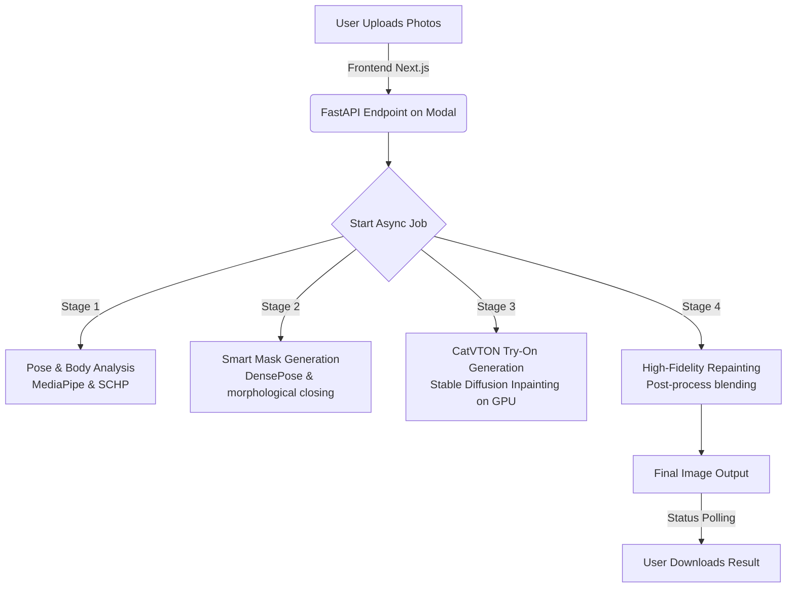

# NextGen Smart Virtual Try-On System

An AI-powered, high-fidelity virtual try-on application that allows users to realistically visualize garments on their photos. Using state-of-the-art vision models and human parsing networks, this project offers seamless garment mapping with precise texture retention, 3D draping, and structure preservation.

---

## 🏗️ Architecture & Pipeline Flow

The application follows a modular, distributed architecture separating the user interface (Next.js) from the compute-intensive AI generation pipeline (Modal + GPU).



---

## 🌟 Key Features

- **High-Fidelity Try-On (CatVTON):** Powered by the state-of-the-art CatVTON (Concatenation-Based Virtual Try-On) diffusion pipeline, maintaining accurate garment colors, patterns, logos, and textures.
- **Smart Agnostic Masking:** Automatically isolates the torso, arms, and clothing regions using **DensePose** and **SCHP (Self-Correction for Human Parsing)**. 
- **Convex Hull Free Fitting:** Uses advanced morphological closing (`cv2.MORPH_CLOSE`) instead of rigid convex hulls to trace body contours precisely, avoiding the "ballooning" or "fat" fitting artifacts common in basic pipelines.
- **High-Resolution Repainting:** Blends the raw inpainted garment back onto the original high-resolution photo, preserving 100% of the original face, hair, hand, and background details.
- **Distributed GPU Backend:** Leverages **Modal Labs** to host the CatVTON models on NVIDIA A10G GPUs with auto-scaling and zero warm-up management.
- **Modern Premium Interface:** A Next.js frontend styled with curated color schemes, smooth glassmorphism, responsive upload cards, and micro-animations.

---

## 🛠️ Tech Stack

### Frontend
- **Framework:** Next.js (App Router, React)
- **Styling:** Vanilla CSS (curated design system, premium typography, custom micro-interactions)
- **Deployment:** Vercel

### Backend (Serverless GPU Compute)
- **Platform:** [Modal](https://modal.com/)
- **Inference Hardware:** NVIDIA A10G GPU (24GB VRAM)
- **Models Used:**
  - **Try-On:** CatVTON Pipeline (fine-tuned on Stable Diffusion Inpainting)
  - **Human Parsing:** SCHP (LIP & ATR configs)
  - **Body Tracking:** DensePose (Detectron2) & MediaPipe Pose

---

## 📂 Project Structure

```
├── backend/                  # Serverless GPU Backend (Modal App)
│   ├── CatVTON/              # CatVTON model wrapper and utilities
│   │   ├── model/            # Pipeline & cloth masking logic
│   │   └── utils.py          # Image resizing and repainting helpers
│   └── modal_app.py          # Modal entrypoints, endpoints & orchestration
├── frontend/                 # Next.js Web Client
│   ├── public/               # Static assets
│   └── src/                  # React Application source
│       ├── app/              # App Router pages (Upload, Processing, Result)
│       ├── components/       # UI elements (Cards, Buttons, Toggles)
│       └── lib/              # State context & API helpers
```

---

## 🚀 Setup & Local Development

### 1. Backend Setup (Modal)

Make sure you have [Modal CLI](https://modal.com/) installed and configured on your machine.

1. **Clone the repository:**
   ```bash
   git clone https://github.com/m-abdullah-amir/Virtual-clothes-TryOn.git
   cd Virtual-clothes-TryOn
   ```

2. **Authenticate with Modal:**
   ```bash
   modal setup
   ```

3. **Deploy the backend pipeline:**
   ```bash
   modal deploy backend/modal_app.py
   ```
   *This will compile the GPU container image, download the models, and deploy the FastAPI web server to the Modal cloud.*

### 2. Frontend Setup (Next.js)

1. **Navigate to the frontend folder:**
   ```bash
   cd frontend
   ```

2. **Install dependencies:**
   ```bash
   npm install
   ```

3. **Configure API endpoints:**
   Update the endpoint URLs in [api.ts](file:///c:/Users/BN%20Computers/Downloads/Virtual-clothes-TryOn/frontend/src/lib/api.ts#L1-L2) to match your deployed Modal app links:
   ```typescript
   const MODAL_TRYON_URL = "https://your-workspace-name--virtual-tryon-tryon.modal.run";
   const MODAL_STATUS_URL = "https://your-workspace-name--virtual-tryon-status.modal.run";
   ```

4. **Run the development server:**
   ```bash
   npm run dev
   ```

5. **Build for production:**
   ```bash
   npm run build
   ```

---

## 🛡️ License

This project is licensed under the MIT License - see the LICENSE file for details.
